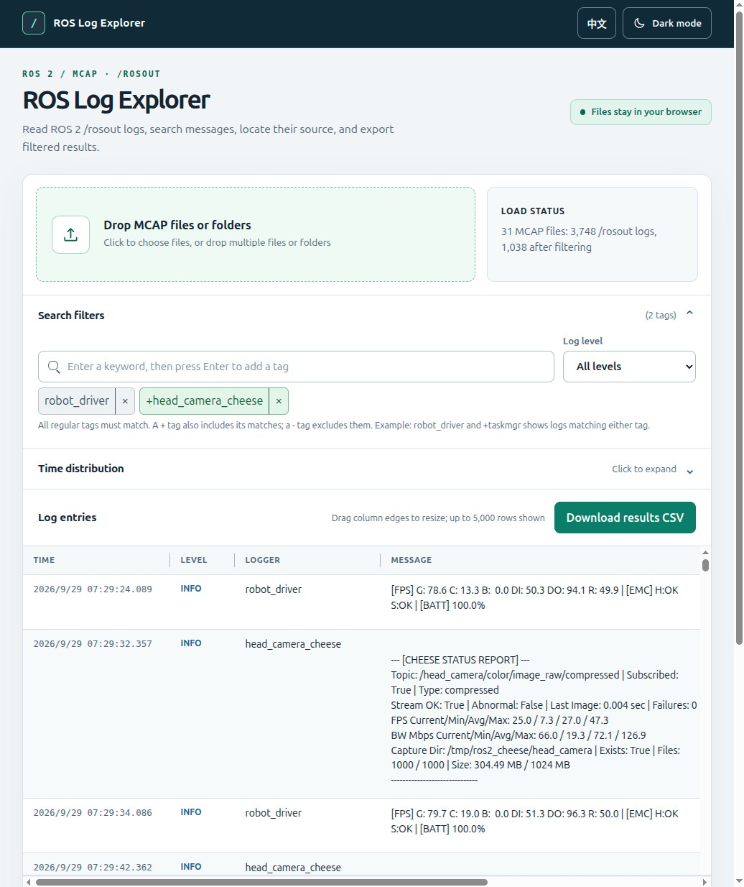

# ROS Log Explorer

English | [繁體中文](./README_zh.md)

[Open ROS Log Explorer online](https://howardwhile.github.io/roslog_explorer/)

Analyze the `/rosout` logs in ROS 2 MCAP files right in your browser. Drop in files, find events by message text, logger, severity, or time range, and export the filtered results as CSV.

**No installation or file upload required.** Files are read and processed locally in your browser.

## Quick start

1. Open [roslog_explorer.html](./roslog_explorer.html).
2. Click the load area to select one or more `.mcap` files, or drop files or folders onto the page.
3. Once loading finishes, inspect the log list and narrow the results by search terms, log level, or the time distribution.
4. Click **Download Results CSV** to export all logs that match the current filters.

Use the controls in the upper right to switch between Traditional Chinese and English or between light and dark themes. The time distribution appears after logs are loaded.

## What you can do

- **Spot anomalies quickly:** Find periods with WARN and ERROR/FATAL logs in the time distribution, then drag to select a time range.
- **Trace message sources:** Search logger names, message text, source files, functions, and MCAP filenames. The table also shows source line numbers.
- **View multiple files together:** Load several MCAP files, sort logs by time, and retain the source MCAP filename for each entry.
- **Share analysis results:** Export the filtered logs as CSV for further work in a spreadsheet or another tool.

## Search and filtering

Type in the search box and press **Enter** to add a search tag. Logger name suggestions appear as you type. Click a tag to edit it, or click its × to remove it.

| Input | Effect |
| --- | --- |
| `robot_driver` | Regular tag; all regular tags must match. |
| `+taskmgr` | Also include logs matching this tag. |
| `-heartbeat` | Exclude logs matching this tag. |

For example, `robot_driver` and `+taskmgr` show logs matching either condition. Adding `-heartbeat` excludes logs containing `heartbeat`. Search is case insensitive and checks severity, logger, message, source file, function, and MCAP filename.

**Log Level** sets the minimum severity to display. Drag on the timeline to select a range. For precise times, expand **Advanced Time Settings** and enter start and end times. Click **Clear Time Range** to return to the full period.

## Support and limitations

- Reads indexed MCAP files with the `.mcap` extension.
- Reads the `/rosout` topic with CDR-encoded messages whose schema name contains `rcl_interfaces/msg/Log`.
- Compressed data chunks are not currently decompressed. An unsupported compression format causes a read error.
- The table shows at most the first **5,000** matching logs; CSV includes **all** matching logs.
- Folder drop depends on browser support for folder reading APIs. If it does not work, select or drop MCAP files directly.

## FAQ

### No logs after loading?

Check that the MCAP contains the `/rosout` topic and that its messages meet the requirements above. File-specific problems appear in the loading status or error messages.

### Why does the CSV contain more rows than the table?

For responsiveness, the table shows only the first 5,000 matches. The CSV exports every log matching the current search, severity, and time filters. Its columns include time, severity, logger, message, MCAP filename, source file, function, and line number.

### Are files sent to a server?

The page parses files selected from your device in the browser. The application has no upload flow.

## Next step

Open the [explorer](./roslog_explorer.html), load an MCAP file containing `/rosout`, filter to WARN and above, and use the time distribution to find an anomalous period.

## Changelog

See [CHANGELOG.md](./CHANGELOG.md) for release notes.

## License

This project is licensed under the [MIT License](./LICENSE).
